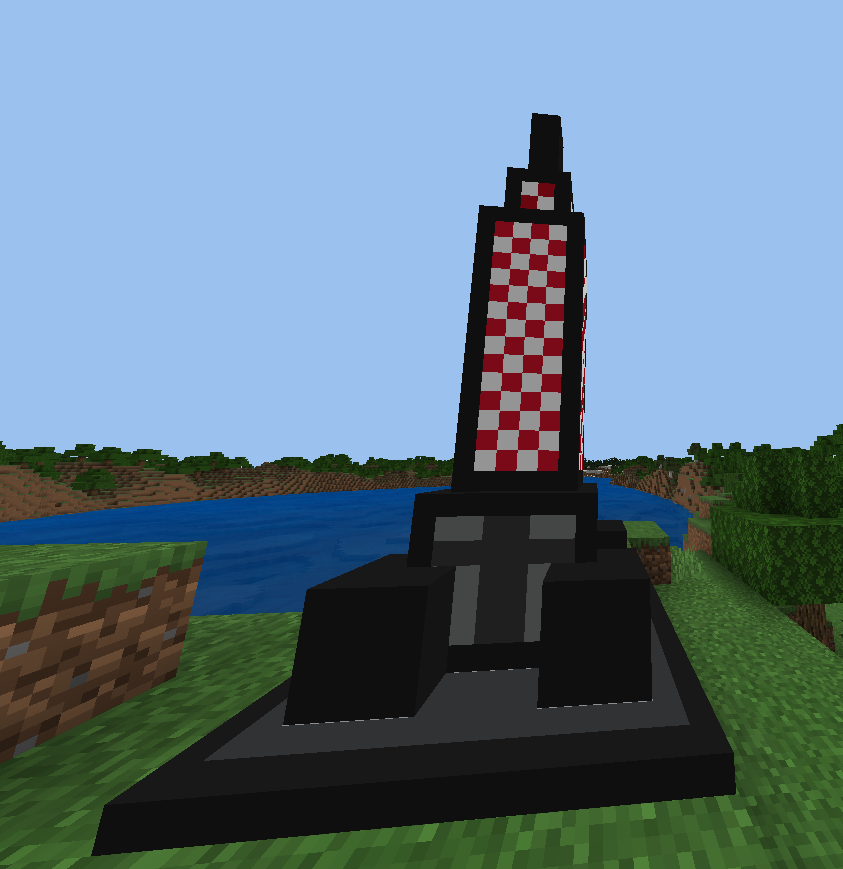
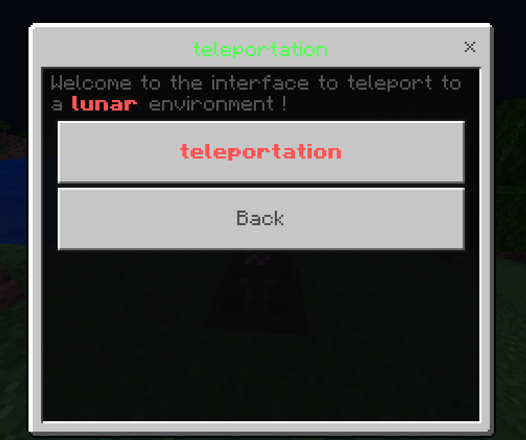

# Gravity
- what is gravity?
Gravity is an early development plugin designed to mimic gravity as well as any other factor on the moon.
The factors present in the plugin for the moment : 
- gravity
- oxygen

## présentation
- Youtube : https://youtu.be/gxEh3ZR7N2Y

## 3.0.0

- adding a rocket, when you click on it, it opens a menu to teleport us to another world (which you will configure in config.yml)
- adding commands /launch (spawn:remove) to spawn or remove a rocket (permission: "gravity.spawn.launch")

## 4.0.0 soon...
- added configuration of all messages
- code clean
- possibilité de pouvoir setup des zone, avec une commande /pos1 /pos2 /zone create <name>

### contact 
- Email: elysiomartinspro@gmail.com
- Discord: Refaltor#1000
